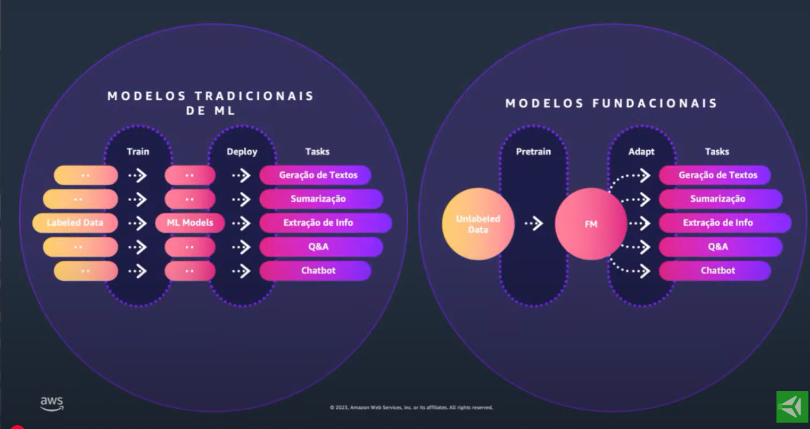
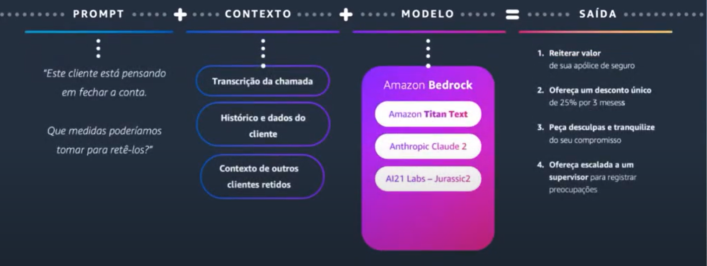
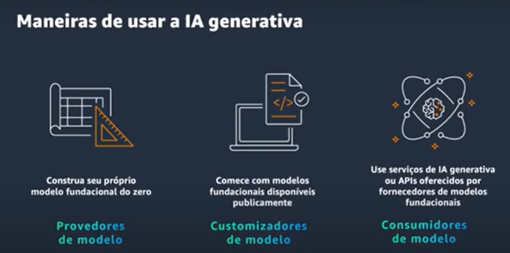
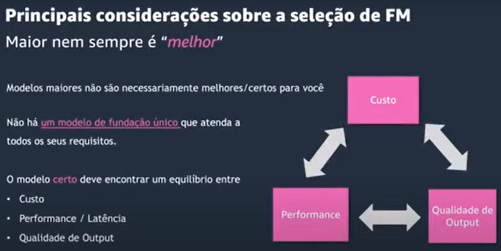
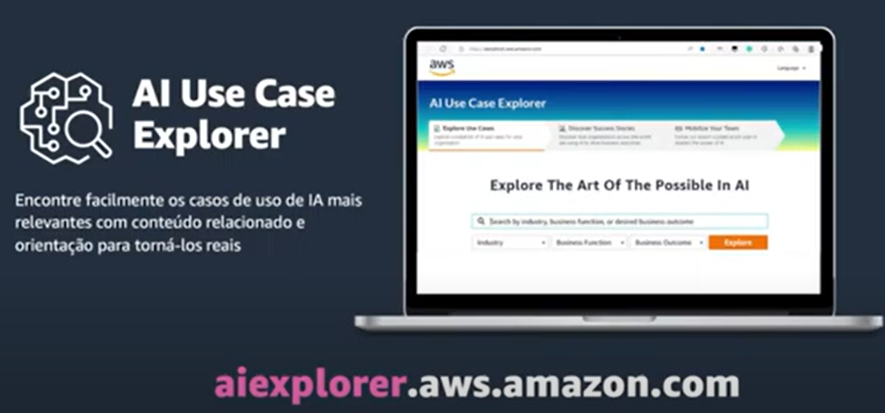

# Introdução à IA Generativa na AWS

A Amazon Web Services (AWS) é uma plataforma líder que oferece soluções avançadas de IA Generativa, alinhando-se com as necessidades crescentes de inovação em diversas indústrias. Neste curso, introduziremos o papel da AWS no universo da IA Generativa, destacando suas ferramentas e serviços que facilitam o desenvolvimento de aplicações inovadoras de IA.

# Machine Learning

- Processo onde a máquina faz uma **inferência** de uma resposta baseada nos dados que foram usados para treiná-la

- Modelos específicos (texto, imagem, análise de sentimentos, etc)

# O que é IA Generativa

- Esse tipo de área tem potencial para afetar todas as áreas do mundo, principalmente as industriais

- Dados + Poder Computacional = AI Generativa / ML

- Os modelos fundacionais / modelos de fundação (FM) são os que dão origem à IA Generativa

- Não é específico (é uma IA de propósito geral)

- É realmente um modelo de propósito geral (faz tudo)

- Foi treinado com dados não rotulados, mas usando um volume imenso de dados

# Como Interagir Com Esses Modelos de Fundação (IA Generativa)

- Promptig Engineering

# Como as Empresas Estão Adotando Esses Serviços

Há três principais pilares de aplicação

- Melhorar a experiência dos clientes

- Aumentar produtividade e acelerar processos de criação

  - Criação de conteúdo
  - Pesquisa, sumarização e análise
  - Geração de relatórios e insights
  - Geração de código

- Otimizar processos de negócios

  - Processamento de documentos -> Poder **CONVERSAR** com documentos (um dos mais procurados por empresas)
  - Data augmentation

# IA Generativa na AWS

- Formas de usar

- **Amazon Bedrocks:** possibilia usar diversos tipos de modelos de fundação
  - Oferece agentes (IA especializada em uma tarefa)

- Modelos de fundação sozinhos não conseguem realizar tarefas, já agentes conseguem

>### Seu dado é seu diferencial competitivo!

# Como Encontrar os Melhores Casos de Uso Para Sua Empresa

# Configuração Bedrock

- Knowledge Base (configuração do modelo)

- Consigo usar diferentes tipos de modelos e fazer requisições pra ele via API

- Consigo criar um fine-tining apenas via clicks, e criar um modelo treinado nos documentos ou dados que eu configurar lá dentro

- Os dados não são compartilhados com ninguém. Eles pertencem apenas à minha conta.

