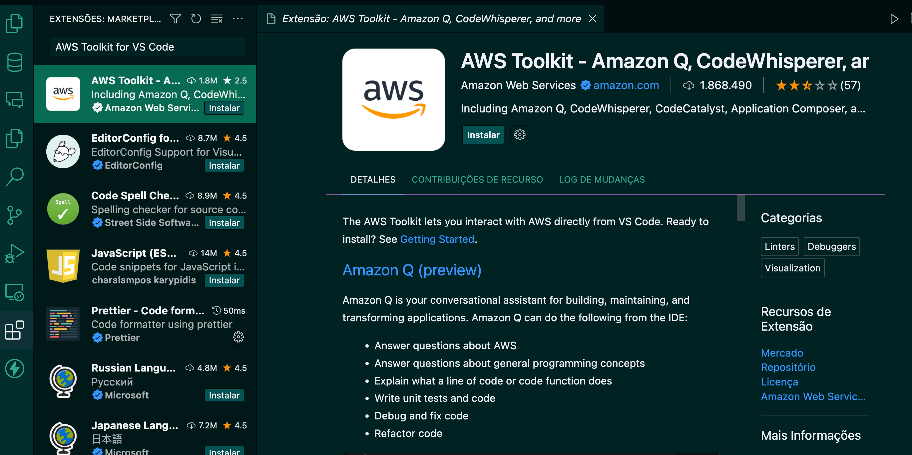
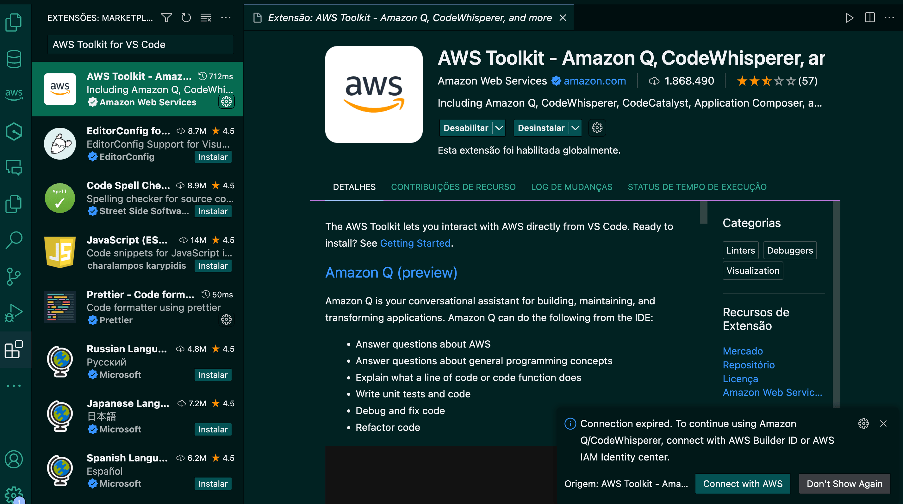
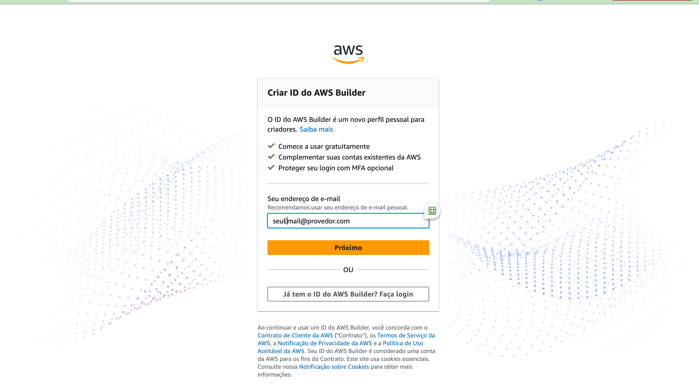
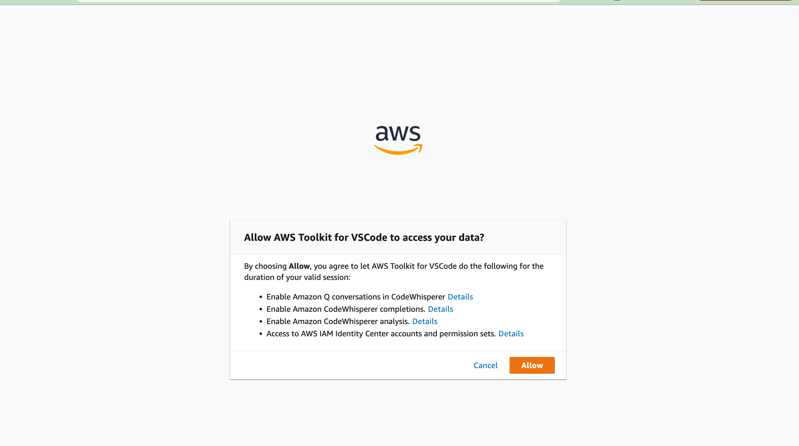
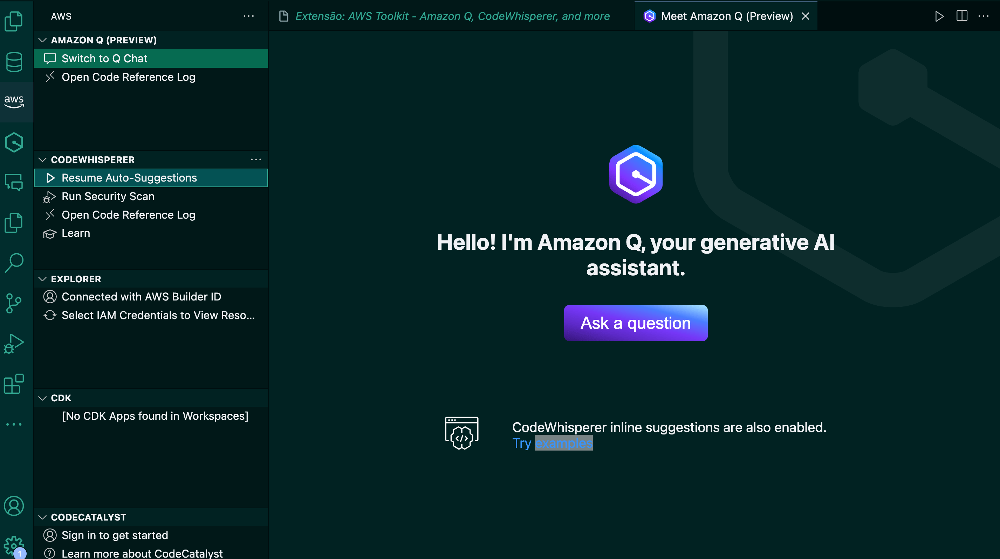
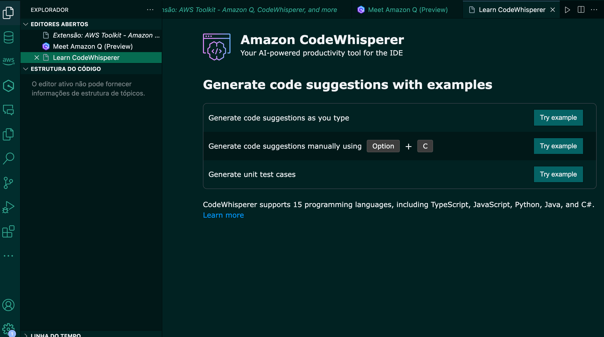

# Como usar o Code Whisperer?

Vamos aqui prover o tutorial para a instalação do Code Whisperer no VSCode. Caso queira usá-lo em outras plataformas, na nossa seção de referências e recursos adicionais temos o link da documentação que contém os demais tutoriais de instalação.

Antes de mais nada, instale a extensão AWS Toolkit - Amazon Q, CodeWhisperer, and more ou nome similar a partir da loja de extensões da ferramenta.

Após instalar, o VSCode irá pedir para que você faça login em sua conta da AWS. Siga adiante nesse processo - ele te direcionará para o browser.

Se você não tiver uma conta AWS, siga as instruções da página e crie uma.

Estamos quase lá! Para usar a ferramenta, é necessário permitir à Amazon o acesso a certos dados. Leia quais são e, caso concorde, siga adiante.

Por fim, acesse a extensão no VSCode, com o login já feito, e habilite as auto-suggestions

Pronto! Agora acesse os três exemplos que a ferramenta fornece para aprender a usá-la. São rápidos e muito úteis!

# Três formas de usar

Lembre-se que você pode utilizar o Code Whisperer de três maneiras:

1 - Iniciando uma linha nova, apertando, por exemplo, o Enter, e esperando ele completá-la, usando Tab e demais atalhos para circular pelas sugestões e aceitar alguma.

2 - Apertando Alt + C, ou Option + C, para ver numa lista todas as opções de código que o Code Whisperer gerou para aquela linha.

3 - Escrevendo um comentário com um comando, como Faça um teste automatizado para a função LALALA, e deixando o Code Whisperer autocompletar na linha seguinte uma porção maior de código.

Nas nossas referências e recursos adicionais temos a página de documentação onde você pode conferir os atalhos para seu ambiente e testá-los.