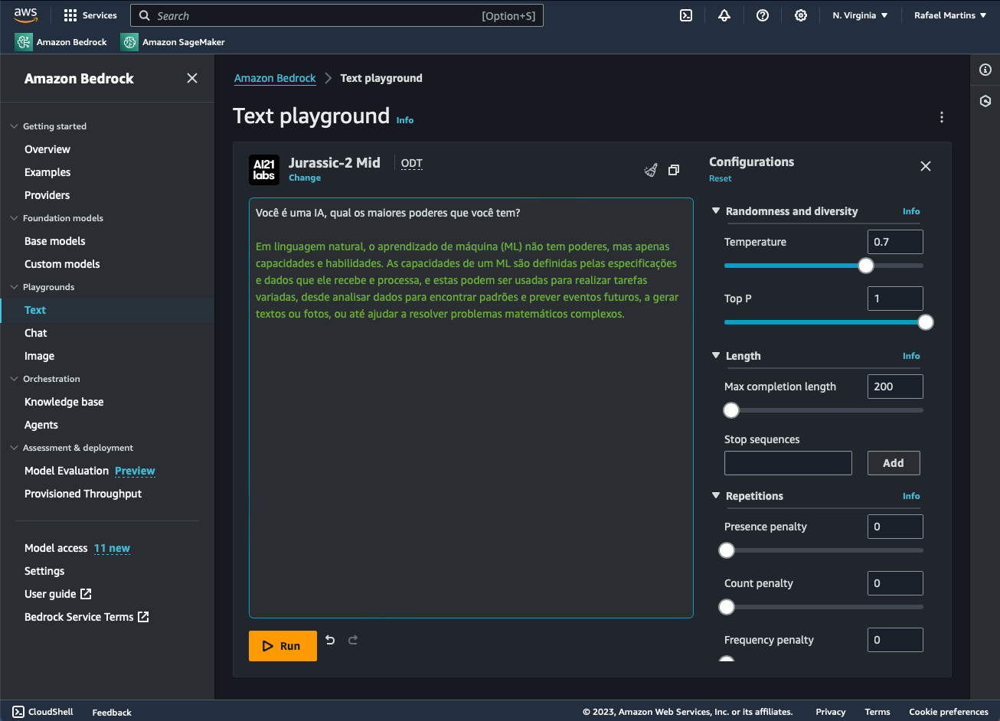

# Configuração de acesso ao Amazon Bedrock

Antes de começarmos a utilizar o Amazon Bedrock precisamos configurar nosso ambiente para iniciarmos nossa interação com a ferramenta.

A utilização do Bedrock se dá através da linguagem Python pela biblioteca boto3. Porém, antes de começarmos a escrever nossos códigos, precisamos configurar todo nosso ambiente, seja local (pelas IDEs) ou remoto (pelo Sagemaker).

Para configuração do ambiente, precisamos:

1 - Acessar a ferramenta pela conta AWS Console

2 - Pedir acesso aos modelos

3 - Criar um usuário de acesso via código

4 - Criar políticas de acesso ao serviço Bedrock

5 - Relacionar a política de acesso a um dado usuário

Bora ver como executar esses passos na prática?

# Abrir o Bedrock no AWS Console

Para acessar o Amazon Bedrock, basta entrar na página inicial do console da AWS, pesquisar por Bedrock e acessar o serviço, clicando no ícone Amazon Bedrock, e depois no botão “Get started”

Feito isso, você deve estar na página de Overview do Amazon Bedrock:

Essa página encontra tudo o que iremos precisar para as configurações. Explore um pouco a página para encontrar as possibilidades.

# Acesso aos modelos

Nosso próximo passo é pedir acesso aos modelos. Ter acesso aos modelos não gera nenhum custo para sua conta, portanto vamos pedir acesso a todos os modelos disponíveis.

No menu lateral, navegue até Model access, uma lista com todos os modelos deve aparecer. Então clique no botão Manage model access, no canto superior direito da lista e selecione os modelos que quer pedir o acesso. Após isso clique no botão Save changes no canto inferior direito da tabela, conforme nas imagens:

Com isso, enviamos o pedido de acesso aos modelos. Pode levar um tempo para o acesso ser liberado, mas assim que os acessos forem concedidos, você já pode iniciar o uso da ferramenta.

# Playground

Para esquentar o nosso motor e sentir o sabor do que podemos fazer, vamos brincar um pouco no playground. Para tanto, no menu lateral, acesse Text dentro da seção Playground:

Selecione o modelo desejado e comece a interagir com o Bedrock.

Você poderá escolher outros playgrounds, comece a explorar a ferramenta.

>Atenção ⚠️: Não se esqueça que o playground utiliza o serviço do Bedrock da sua conta da AWS, ou seja, o consumo será cobrado. Acesse a página de preços no link [Bedrock Pricing](https://aws.amazon.com/pt/bedrock/pricing/) para saber mais sobre o custo pelo consumo de cada modelo.

# Criação de usuário e permissão de uso do Bedrock

Para interagir com o Amazon Bedrock fora do playground, isto é, pela IDE de sua preferência ou até mesmo pela próprio SageMaker, é necessário conceder acesso ao seu usuário da AWS.

Esse acesso é liberado através das políticas adicionadas no seu Identity and Access Management (IAM). Para isso, será necessário acessar o IAM no seu console e criar a permissão aos modelos do Amazon Bedrock.

A partir da página do Console Home, pesquise por IAM e entre no serviço IAM:

Primeiramente vamos criar a política de permissão através do Policies na seção Access management no menu lateral:

Clique no botão Create policy no canto superior direito. No passo 1 (Step 1) em Specify permissions selecione a aba JSON, coloque o código abaixo e clique em Next.

Policy:

    {
        "Version": "2012-10-17",
        "Statement": [
            {
                "Sid": "VisualEditor",
                "Effect": "Allow",
                "Action": [
                    "bedrock:InvokeModel",
                    "bedrock:ListCustomModels",
                    "bedrock:ListFoundationModels"
                ],
                "Resource": "*"
            }
        ]
    }

No passo 2 (Step 2), defina um nome para a política, bedrock_policy por exemplo, e clique no botão Create policy

Uma vez a política criada, precisamos associá-la a um user, portanto, no menu lateral, abra o link Users. Caso você não tenha nenhum usuário, clique no botão Create user para criar um novo.

Serão três novos passos, no primeiro definimos o nome do usuário

No segundo passo, associamos a política que acabamos de criar, para isso selecione Attach policies directly, na lista de políticas, filtre pelo nome da política que acabou de criar (bedrockpolicy), marque no checkbox e clique em _Next.

O terceiro passo é apenas revisão, basta clicar no botão Create user.

Caso você queira adicionar a nova política a um usuário já existente, basta clicar sobre o usuário desejado, seguir para aba Permission, clicar no botão Add permissions e então na opção Add permissions novamente.

Com isso irá aparecer a mesma tela do segundo passo da criação do novo usuário, siga as instruções acima.

Agora temos tudo pronto! Já sabemos por onde iniciar o Bedrock e como criar as permissões necessárias para seu usuário AWS. Na próxima lição vamos aprender, na prática, como interagir com o Bedrock programaticamente.