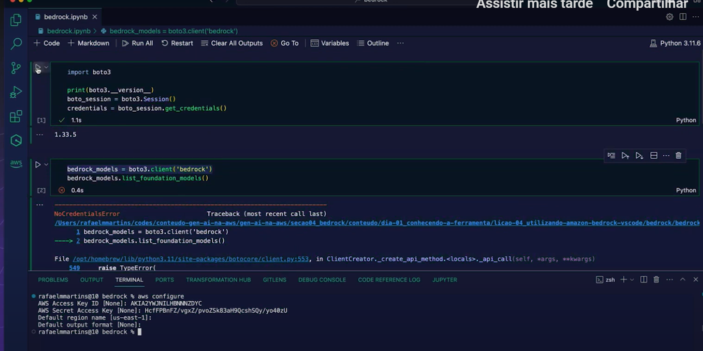

# Acessando Amazon Bedrock em seu Ambiente Local

Para acessar o Amazon Bedrock em seu ambiente local, isto é no VS Code, ou qualquer IDE de usa preferência, é necessário configurar o acesso ao Bedrock a partir da sua máquina local.

Será necessário a instalação do [AWS Command Line Interface](https://aws.amazon.com/pt/cli/), para isso siga os passos de instalação no próprio site da AWS.

Nesse próximo vídeo, você irá aprender como fazer as configurações de acesso ao Amazon Bedrock a partir da sua máquina e utilizar no VS Code.

- É justamente a parte de configurar o acesso pelo cli da aws

      aws configure

--> Vai pedir todas as informações secretas da conta. Basta ir na aws e pesquisar por ***IAM***

--> IAM --> User --> Security Credentials --> Access keys

>***SE NÃO TIVER UM BEDROCK POLICY ADICIONADO, NÃO CONSIGO TER PERMISSÃO DE ACESSAR***

> Atenção ⚠️: Nesse vídeo foi utilizado a política de permissão do IAM criado na lição anterior.

Código utilizado no vídeo:

    import boto3

    print(boto3.__version__)
    boto_session = boto3.Session()
    credentials = boto_session.get_credentials()

    bedrock_models = boto3.client('bedrock')
    bedrock_models.list_foundation_models()
